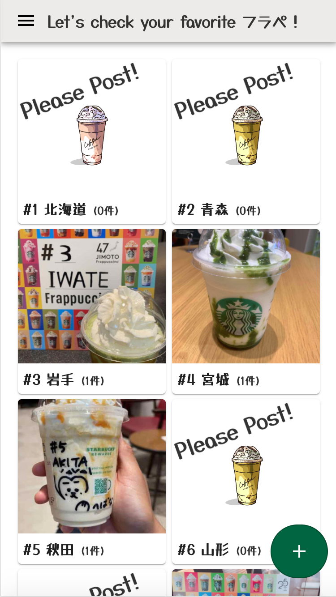
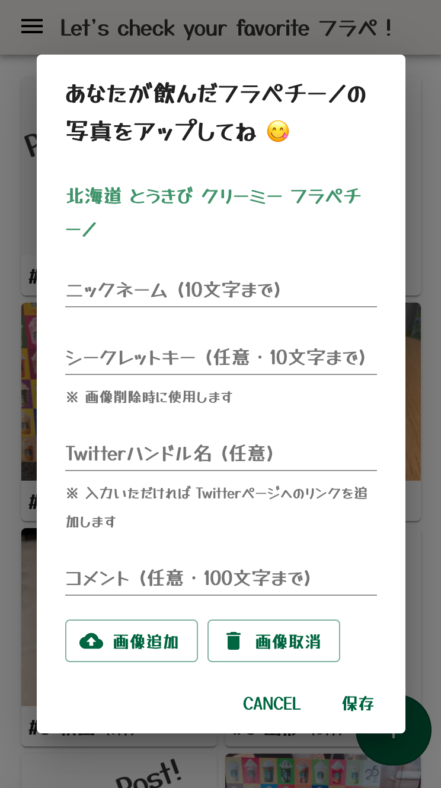
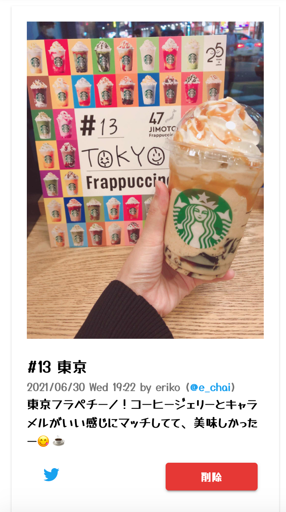

# STARBUCKS 47 JIMOTO Frappuccino 投稿サイト

# このリポジトリについて / About
2021年6月30日から8月3日までの期間限定で始まった [STARBUCKS JAPAN 47JIMOTO フラペチーノ](https://www.starbucks.co.jp/cafe/jimoto_frappuccino/)  

このフラペチーノの画像を投稿するサイトのリポジトリです。  
実際のコードは [リポジトリ](https://github.com/nouvelle/sbux-47pref#リポジトリ) にあります。

# 構成 / Architecture

# リポジトリ
Frontーend: https://github.com/nouvelle/sbux-47pref-front  
Back-end: https://github.com/nouvelle/sbux-47pref-back  

# 開発方法 / Development
各リポジトリの README をご確認ください。

# コントリビューション / Contributing
Issues & Pull requests are welcome!! 😊

# ライセンス / License
[MIT](https://choosealicense.com/licenses/mit/)

